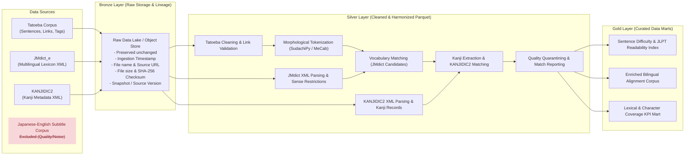
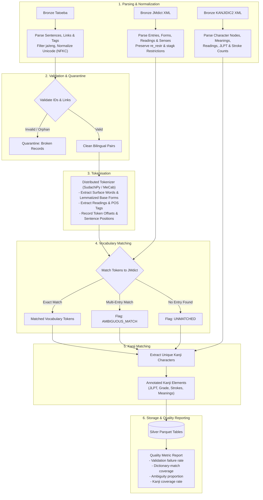

# Japanese-English Lexical & Parallel Sentence Data Pipeline
### Medallion Architecture with PySpark

[](https://github.com/alkval/project_07/actions)
[](https://www.gnu.org/licenses/gpl-3.0)
[](https://spark.apache.org/)
[](https://www.python.org/)

---

## Executive Summary

This project implements an end-to-end, batch-oriented data engineering pipeline designed under the **Medallion Architecture (Bronze &rarr; Silver &rarr; Gold)** using **Apache Spark (PySpark)**. The pipeline ingests, cleans, harmonizes, and enriches Japanese-English parallel texts and comprehensive lexicographical resources.

By combining the **Tatoeba Project** parallel sentence corpus with foundational linguistic dictionaries (**JMdict** and **KANJIDIC2**), the pipeline performs morphological tokenization, deterministic vocabulary matching, and kanji character decomposition. Downstream, the platform serves curated analytical datasets and language-learning metrics (e.g., JLPT grading, lexical complexity scoring, and bilingual alignment).



---

## 1. Project Statement (Scope)

### Problem & Analytical Motivation
Japanese is an agglutinative language written without inter-word spacing across three distinct writing systems (Kanji, Hiragana, and Katakana). Parallel bilingual corpora (such as Tatoeba) provide abundant contextual usage examples, but raw sentence pairs lack morphological parsing, lexical definitions, and character difficulty metrics. Conversely, rich lexical databases such as JMdict and KANJIDIC2 exist in monolithic, highly nested XML formats that are computationally cumbersome to join against sentence corpora at scale.

Existing open-source corpora are frequently fragmented, contain broken cross-reference links, or exhibit low fidelity (as observed in noisy subtitle corpora). Language learners, lexicographers, and NLP practitioners require a clean, structurally unified dataset where every sentence is deterministically tokenized, paired with its authoritative dictionary entry, and indexed by kanji difficulty.

### Intended Outcome
To build a scalable, reproducible PySpark pipeline that:
1. Ingests and version-controls raw Japanese parallel text and lexicographical resources in an immutable **Bronze** layer.
2. Normalizes, tokenizes, validates, and structurally relates sentences to dictionary definitions and kanji attributes in a typed, columnar **Silver** layer (stored as Parquet).
3. Delivers high-performance **Gold** data marts supporting sentence-level readability scoring, vocabulary difficulty profiling (JLPT N5&ndash;N1), and parallel alignment analytics.

### Target Consumers
- **Educational Technology & Language Apps:** Downstream spaced-repetition platforms (e.g., Anki decks, reader applications) requiring graded parallel sentences.
- **NLP Researchers & Corpus Linguists:** Teams training tokenizer/lemmatizer models or evaluating cross-lingual alignment.
- **Data Analysts & BI Consumers:** Stakeholders monitoring corpus quality, kanji distribution, and vocabulary coverage.

### Out of Scope
- **Real-Time Streaming:** The pipeline processes batch snapshots; real-time streaming ingestion (e.g., Kafka/Spark Structured Streaming) is excluded from the initial scope.
- **Heuristic / Probabilistic Sense Guessing:** If a token matches multiple homographs in JMdict without sufficient grammatical constraints, the pipeline flags it as `AMBIGUOUS_MATCH` rather than guessing a specific sense.
- **Corpus Evaluation of Low-Fidelity Sources:** The Japanese-English Subtitle Corpus was evaluated during preliminary research and explicitly excluded due to unacceptable noise and misalignment rates (detailed in Section 2).

---

## 2. Dataset (Source and Suitability)

### Primary Data Sources

| Source | Format | Ingestion Volume / Pattern | Description & Role |
| :--- | :--- | :--- | :--- |
| **Tatoeba Project** | TSV / CSV (`tar.bz2`) | Weekly / Monthly Batch (~400MB compressed, ~2M+ sentences) | Crowdsourced bilingual sentence pairs, translation cross-links (`links.csv`), and user-annotated tags (`tags.csv`). |
| **JMdict_e** | XML (`.gz`) | Bi-weekly / Monthly Batch (~75MB uncompressed XML) | Electronic Japanese-English dictionary maintained by EDRDG (Jim Breen). Contains ~190,000 entries with kanji variants, kana readings, POS tags, and sense restrictions. |
| **KANJIDIC2** | XML (`.gz`) | Monthly Batch (~8MB XML) | Comprehensive kanji database containing 13,000+ characters with Joyo grade, JLPT rating, stroke count, frequency rank, and English meanings. |
| ~~**Japanese-English Subtitle Corpus**~~ | Text / SubRip | *Excluded from Pipeline* | **Excluded:** Evaluated during preliminary analysis. Subtitle corpora exhibited severe timing drift, OCR/ASR artifacts, extreme colloquial contractions, and loose translations that created prohibitive noise in automated vocabulary alignment. |

### Distributed Processing Suitability
- **Volume & Structural Complexity:** Parsing millions of parallel sentences combined with high-cardinality nested XML dictionaries requires distributed memory processing. Spark decomposes the sentence corpus across partitions, allowing parallelized tokenization and distributed relational joins.
- **Columnar Efficiency:** Transitioning from deeply nested XML and unindexed TSVs into compressed columnar Parquet yields an order-of-magnitude reduction in disk footprint and scan latency.

### Source Limitations & Quality Risks
- **One-to-Many Translation Fan-out:** A single Japanese sentence may link to multiple English translations, some of varying quality or grammatical tense.
- **Nested Reading & Sense Restrictions in JMdict:** Certain readings (`<reb>`) only apply to specific kanji headwords (`<keb>`), and senses (`<sense>`) may be restricted to subset readings (`<re_restr>`). Flattening without preserving restrictions leads to invalid cross-products.
- **Orphan Records & Incomplete IDs:** Sentence IDs referenced in `links.csv` may not exist in `sentences.csv`.
- **Character Encoding & Normalization:** Mixed full-width/half-width alphanumeric characters, variations in Japanese punctuation, and historical kanji variants.

### Licensing & Reproducibility
- **Tatoeba:** Creative Commons Attribution 2.0 France (CC-BY 2.0 FR).
- **JMdict & KANJIDIC2:** Creative Commons Attribution-ShareAlike 3.0 / 4.0 International (EDRDG).
- **Codebase License:** GNU General Public License v3.0 (GPL-3.0).
- **Reproducibility:** Source URLs, checksums, and version tags are archived in Bronze metadata catalogs to enable deterministic rebuilds.

---

## 3. Bronze Layer (Ingest and Preserve)

### Ingestion Strategy
The Bronze layer acts as an append-only, immutable landing zone. Source artifacts are ingested directly via scheduled batch jobs from upstream mirrors, unpacked without mutation, and registered with operational metadata.

```
data/bronze/
├── _metadata/
│   └── ingestion_log.parquet
├── tatoeba/
│   └── snapshot_date=2026-10-01/
│       ├── sentences.tsv
│       ├── links.tsv
│       └── tags.tsv
├── jmdict/
│   └── snapshot_date=2026-10-01/
│       └── JMdict_e.xml
└── kanjidic2/
    └── snapshot_date=2026-10-01/
        └── kanjidic2.xml
```

### Bronze Metadata Schema
Every ingested file is paired with an entry in the Bronze Metadata Manifest:

| Attribute | Type | Description |
| :--- | :--- | :--- |
| `source_name` | `STRING` | Identifier (`tatoeba`, `jmdict`, `kanjidic2`) |
| `file_name` | `STRING` | Original raw archive filename |
| `source_url` | `STRING` | Fully qualified upstream download URL |
| `download_timestamp` | `TIMESTAMP` | UTC timestamp of retrieval |
| `size_bytes` | `BIGINT` | File size on storage |
| `sha256_checksum` | `STRING` | Hex-encoded SHA-256 hash verifying raw integrity |
| `snapshot_date` | `DATE` | Logical extraction snapshot date partition key |
| `ingestion_run_id` | `STRING` | UUID representing the execution run |

### Traceability, Idempotency & Late Data
- **Idempotency:** Re-running an ingestion job for an existing `snapshot_date` validates the SHA-256 hash. If unchanged, the job skips download to prevent duplication. If the upstream hash differs, a new revision partition is appended.
- **Preservation:** No text stripping, tokenization, or column renaming occurs in Bronze. Raw files remain 100% bit-exact representations of upstream releases.

---

## 4. Silver Layer (Primary Focus)

The Silver layer enforces schema validation, relational normalization, morphological parsing, entity matching, and data quality quarantining.

### Step-by-Step Silver Pipeline



### 1. Data Understanding & Grain Definition

| Entity / Table | Core Grain | Essential Attributes | Derived / Enriched Attributes |
| :--- | :--- | :--- | :--- |
| `silver_sentences` | 1 record per sentence | `sentence_id`, `lang`, `text` | Character count, script composition flags (has_kanji, has_kana) |
| `silver_sentence_links` | 1 record per verified bilingual pair | `jp_sentence_id`, `en_sentence_id` | Translation rank/alternative index |
| `silver_sentence_tokens` | 1 record per token occurrence in sentence | `sentence_id`, `token_idx`, `surface_form`, `base_form`, `pos` | Token reading, start/end char offsets |
| `silver_jmdict_entries` | 1 record per sense definition | `entry_id`, `sense_idx`, `pos`, `glossary` | Applicable kanji heads, applicable kana readings |
| `silver_token_vocabulary_matches` | 1 record per token-to-lexicon join candidate | `sentence_id`, `token_idx`, `match_status`, `entry_id` | Match confidence score, candidate match count |
| `silver_kanjidic_characters` | 1 record per kanji character | `literal`, `grade`, `stroke_count`, `jlpt_level` | Primary on/kun readings, English meanings |
| `silver_sentence_kanji` | 1 record per distinct kanji per sentence | `sentence_id`, `literal`, `frequency_in_sentence` | Character JLPT level, stroke count |

### 2. Cleaning & Standardization Rules
- **Unicode Normalization:** All Japanese text is normalized via Unicode NFKC to unify full-width ASCII characters, half-width katakana, and ideographic spaces.
- **Link Integrity & Quarantining:** Referential integrity checks confirm that both `jp_sentence_id` and `en_sentence_id` exist in `sentences`. Dangling links and malformed IDs are written to `silver_quarantine_links` for audit.
- **Dictionary Restriction Preservation:** JMdict XML `<re_restr>` (reading restriction) and `<stagk>`/`<stagr>` (sense restriction) tags are extracted as relational arrays rather than flat cartesians to prevent cross-contamination of homophonic words.

### 3. Morphological Tokenization & PySpark Implementation
- Tokenization requires executing a morphological analyzer (e.g., `SudachiPy` with split mode `C` or `fugashi` / `MeCab`) over distributed partitions.
- **Spark Implementation:** To avoid Python serialization bottlenecks, the tokenizer instance is initialized once per Spark partition via `mapPartitions` or implemented as a vectorized Pandas UDF (`pyspark.sql.functions.pandas_udf`).
- **Extracted Token Schema:**
  ```python
  StructType([
      StructField("sentence_id", IntegerType(), False),
      StructField("token_idx", ShortType(), False),
      StructField("surface_form", StringType(), False),
      StructField("base_form", StringType(), False),
      StructField("reading", StringType(), True),
      StructField("pos_major", StringType(), False),
      StructField("pos_minor", StringType(), True),
      StructField("start_offset", ShortType(), False),
      StructField("end_offset", ShortType(), False)
  ])
  ```

### 4. Deterministic Vocabulary & Kanji Matching
- **Vocabulary Matching:** Tokens are joined against `silver_jmdict_entries` using compound join keys `(base_form, reading)`.
  - When exact matching succeeds uniquely &rarr; `status = 'EXACT_MATCH'`.
  - When matching maps to $>1$ distinct entry IDs &rarr; `status = 'AMBIGUOUS_MATCH'` with candidate list preserved in an array.
  - When base form cannot be mapped &rarr; `status = 'UNMATCHED'`.
  - *No synthetic sense assignment or hallucinated defaults are permitted.*
- **Kanji Character Decomposition:** Japanese tokens are split into individual codepoints filtered by the CJK Unified Ideographs block (`U+4E00`&ndash;`U+9FAF`). Distinct characters are joined to `silver_kanjidic_characters`.

### 5. Quality Metrics & Evidence
The Silver layer generates automated quality verification metrics before outputting to Parquet:
- **Link Validity Rate:** $\frac{\text{Valid Bilingual Links}}{\text{Raw Link Rows}} \ge 99.5\%$
- **Tokenization Success Rate:** Percentage of Japanese sentences tokenized without runtime exceptions ($= 100\%$).
- **Dictionary Coverage:** Percentage of content-word tokens (nouns, verbs, adjectives) successfully mapped to JMdict entries.
- **Ambiguity Ratio:** Ratio of ambiguous candidate matches flagged for downstream analysis.
- **Kanji Match Coverage:** Percentage of distinct kanji present in sentences matched to KANJIDIC2 records ($> 99.0\%$).

### 6. Spark Performance Tuning & Evidence-Based Optimizations
- **Broadcast Joins:** `silver_kanjidic_characters` (~13,000 rows, ~5MB) is broadcast via `broadcast(kanjidic_df)` during joins with sentence tokens, eliminating shuffle stages.
- **Salted Joins for Common Particles:** High-frequency functional particles (e.g., の, は, を, に) create potential data skew during joins. The pipeline filters out closed-class grammatical particles from deep lexicon lookups or salts join keys where appropriate.
- **Partitioning Strategy:** Silver Parquet tables are partitioned by `snapshot_date` and bucketed by `sentence_id` (`bucketBy(32, "sentence_id")`) to optimize downstream joins between tokens and parallel translations.

---

## 5. Gold Layer (Serve the Outcome)

The Gold layer aggregates and formats Silver data into specialized data marts tailored for direct consumption by BI dashboards, language learning tools, and linguistic applications.

```
data/gold/
├── sentence_readability_metrics/   # Mart 1: Difficulty & JLPT scoring
├── lexical_alignment_corpus/       # Mart 2: Enriched parallel sentences
└── pipeline_quality_kpis/          # Mart 3: Operational quality metrics
```

### Gold Data Marts

#### Mart 1: Sentence Readability & JLPT Index (`gold_sentence_readability_metrics`)
- **Consumer Need:** Allows language-learning applications to filter and serve sentence examples matched to a learner's exact JLPT level (N5 through N1).
- **Structure:**
  - `sentence_id`
  - `jp_text`, `en_text`
  - `token_count`, `kanji_count`
  - `max_kanji_grade` (Primary school 1&ndash;6, Secondary, Jinmeiyo)
  - `sentence_jlpt_level` (Evaluated via worst-case or median token/kanji JLPT rating: N5, N4, N3, N2, N1)
  - `rare_vocab_ratio` (Proportion of non-standard or unindexed vocabulary)

#### Mart 2: Enriched Bilingual Lexical Corpus (`gold_lexical_alignment_corpus`)
- **Consumer Need:** Export-ready corpus for digital readers, interactive dictionary popups, and parallel NLP corpus evaluation.
- **Structure:** High-level hierarchical records containing the Japanese sentence, verified English translation, an array of token glosses with grammatical POS tags, and associated kanji breakdown cards.

#### Mart 3: Pipeline Quality & Coverage Dashboard (`gold_pipeline_quality_kpis`)
- **Consumer Need:** Operational data mart monitoring pipeline runs across snapshots.
- **Measures:** Ingested count, quarantined count, lexicon coverage rate, average kanji complexity per sentence, and token ambiguity rate.

### Downstream Readiness & Publishing
Gold tables are written using atomic directory swaps (or Delta Lake `overwrite` partitions). Downstream applications consume Gold tables only after all automated schema tests and data quality thresholds pass.

---

## 6. End-to-End Delivery & Operations

### Reproducibility & Environment Separation
The pipeline supports isolated configuration profiles across development, testing, and production environments:
- **Local Dev / Testing:** Executes against subset fixtures with local PySpark master (`local[*]`).
- **Production / Batch Cluster:** Points to distributed object storage / HDFS cluster with tuned Spark executor memory and core configurations.

Environment settings are controlled via configuration files and environment variables:
```bash
# Environment configurations
export ENV="dev"                   # Options: dev, staging, prod
export SPARK_MASTER="local[*]"
export DATA_BASE_DIR="./data"
```

### CI/CD Workflow (GitHub Actions)
Every pull request and merge to `main` triggers automated validation:
1. **Linting & Code Quality:** `flake8`, `black`, and `mypy` static type checking.
2. **Unit & Pipeline Tests:** `pytest` validating XML parsing logic, quarantine routing, and tokenizer boundary conditions using small synthetic datasets.
3. **End-to-End Integration Smoke Test:** Executes Bronze &rarr; Silver &rarr; Gold stages on a mini-corpus fixture, asserting schema stability and expected output row counts.

### Repository Structure
```
project_07/
├── .github/
│   └── workflows/
│       ├── ci.yml                 # Automated linting and pytest pipeline
│       └── scheduled_ingest.yml   # Scheduled batch trigger
├── config/
│   ├── base_config.yaml           # Core schemas, thresholds, URLs
│   ├── dev.yaml                   # Development environment overrides
│   └── prod.yaml                  # Production environment settings
├── data/                          # Data directory (managed by pipeline)
│   ├── bronze/                    # Immutable raw files & metadata
│   ├── silver/                    # Cleaned Parquet & quarantine logs
│   └── gold/                      # Analytical data marts
├── docs/
│   ├── Assignment.pdf             # University course assignment guide
│   └── architecture_diagram.png   # Architectural schematic
├── src/
│   ├── __init__.py
│   ├── common/                    # Shared utilities, spark session, logging
│   │   ├── spark_utils.py
│   │   └── quality_metrics.py
│   ├── bronze/                    # Bronze ingestion & hashing modules
│   │   ├── ingest_tatoeba.py
│   │   ├── ingest_jmdict.py
│   │   └── ingest_kanjidic.py
│   ├── silver/                    # Silver parsing, tokenization & joins
│   │   ├── parse_tatoeba.py
│   │   ├── parse_jmdict.py
│   │   ├── parse_kanjidic.py
│   │   ├── tokenize_sentences.py
│   │   ├── match_vocabulary.py
│   │   └── match_kanji.py
│   └── gold/                      # Gold aggregations & mart generation
│       ├── readability_mart.py
│       └── alignment_corpus_mart.py
├── tests/
│   ├── fixtures/                  # Minimal XML and TSV fixtures
│   ├── test_bronze_ingestion.py
│   ├── test_silver_parsing.py
│   ├── test_tokenization.py
│   └── test_gold_marts.py
├── .gitignore
├── LICENSE                        # GNU General Public License v3
├── README.md                      # Project documentation and specifications
└── requirements.txt               # Python dependencies
```

---

## 7. Getting Started

### Prerequisites
- **Python:** 3.10 or 3.11
- **Java JDK:** OpenJDK 17 or 11 (required for PySpark)
- **Git**

### Installation

1. **Clone the repository:**
   ```bash
   git clone https://github.com/alkval/project_07.git
   cd project_07
   ```

2. **Create and activate a virtual environment:**
   ```bash
   python3 -m venv venv
   source venv/bin/activate
   ```

3. **Install dependencies:**
   ```bash
   pip install --upgrade pip
   pip install -r requirements.txt
   ```

### Running the Pipeline

Execute the pipeline stages sequentially:

```bash
# 1. Ingest raw datasets to Bronze
python -m src.bronze.ingest_tatoeba --env dev
python -m src.bronze.ingest_jmdict --env dev
python -m src.bronze.ingest_kanjidic --env dev

# 2. Process and enrich Silver layer
python -m src.silver.parse_tatoeba --env dev
python -m src.silver.parse_jmdict --env dev
python -m src.silver.parse_kanjidic --env dev
python -m src.silver.tokenize_sentences --env dev
python -m src.silver.match_vocabulary --env dev
python -m src.silver.match_kanji --env dev

# 3. Build Gold analytical marts
python -m src.gold.readability_mart --env dev
python -m src.gold.alignment_corpus_mart --env dev
```

### Running Test Suite
Execute unit and schema validation tests:
```bash
pytest tests/ -v
```

---

## 8. Data Licensing & Attributions

This project utilizes open linguistic datasets provided under permissive licenses:
- **Tatoeba Project:** Released under [Creative Commons Attribution 2.0 France (CC-BY 2.0 FR)](https://creativecommons.org/licenses/by/2.0/fr/). Sentence data contributed by the Tatoeba community.
- **JMdict & KANJIDIC2:** Property of the [Electronic Dictionary Research and Development Group (EDRDG)](http://www.edrdg.org/), used in conformance with the [EDRDG Licence](http://www.edrdg.org/edrdg/licence.html) (Creative Commons Attribution-ShareAlike 3.0 Unported).
- **Pipeline Implementation:** Released under the [GNU General Public License v3.0 (GPL-3.0)](LICENSE).